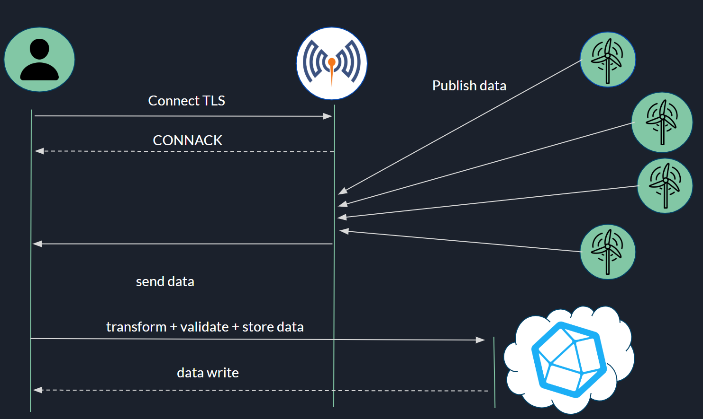

# *Proyecto: Sedes en USA*

## *Descripción*

Este proyecto conecta un broker MQTT con una base de datos InfluxDB. El objetivo es recibir datos meteorológicos de diferentes ciudades de Estados Unidos publicados en MQTT, validar los datos y enviarlos a InfluxDB para su almacenamiento y posteriormente hacer un análisis con Grafana. Utilizamos varios publicadores para enviar los datos y un suscriptor para procesarlos y almacenarlos.

## Objetivo
Este proyecto busca facilitar el monitoreo de datos meteorológicos en tiempo real, permitiendo análisis visuales efectivos para toma de decisiones en diferentes ciudades de Estados Unidos.

## FASES

Estas son las fases del proyecto.

**1. Captura de datos**:


1.  Hemos explorado unos Dataframes de Kaggle sobre generadores eólicos, hemos analizado que datos pueden aportar más valor, y hemos generado un archivo csv nuevo con los datos de la ciudad. 
2. Hemos generado un archivo de python para generar datos sintéticos.

**2. Envío**:

Para el envío utilizados MQTT, lo que hacemos es mandar desde los archivos de **Ciudad.py**, de la carpeta **publishers**. Empleamos el qos2, Quality of Service 2, para conectarse al broker mqtt luego se mandan los datos al subscriptor.py.

**3. Validación**:

Antes de la almacenar los datos, se validan los datos que  los suscriptores no contentan ni valores nulos, vacíos o que no sean Outliers.
También, se comprueba el formato del mensaje, para más detalle clicke [aquí](./index.md/#estructura-del-mensaje-mqtt).

**4. Persistencia de datos**:


Para la persistencia de datos, en el archivo de subscriptor primero hemos formateado el formato del mensaje recibido para que se pueda enviar a Influx correctamente. Luego, hemos empleado la API-REST de InfluxDB le hemos indicado la acción que queríamos hacer, escribir, y le hemos pasado nuestro token para validarnos.

## Funcionamiento del envío de datos 

Esta imagen muestra el funcionamiento del proyecto desde el envío hasta la persistencia del sistema.

**5. Visualización de datos**:

Para la visualización de datos en Grafana, hemos hecho una query de los datos a visualizar a InfluxDB, le hemos pasado nuestro token para que nos valide.

## *Instalación*

*Clonar el repositorio*:
```
git clone <https://github.com/rdo164/XR-CTR.git> 
```
*Instalar las dependencias*:

```
pip install -r requirements.txt
```

## *Estructura del Proyecto*

- subscritor.py: Script principal que establece la conexión con el broker MQTT y procesa los mensajes recibidos.
- requirements.txt: Archivo con las dependencias necesarias para ejecutar el proyecto.
- certs/: Directorio que contiene los certificados necesarios para la comunicación segura con el broker MQTT.
- publishers: Directorio con los los archivos de publicación.
    - LVegas.csv, Portland.csv, Dallas.csv, Denver.csv, Seattle.csv : Archivos CSV con datos de ejemplo para la publicación en MQTT.
    - NewYork.py: Script para generar y publicar **datos sintéticos** en MQTT.

## *Requisitos*

- Python 3.7 o superior
- pip (gestor de paquetes de Python)
- Conexión a internet para instalar las dependencias
- Certificados de seguridad para el broker MQTT (ubicados en ./certs/)
- Instalación de dos2unix


## *Archivos Principales*

**subscritor.py**

Este script principal se encarga de:

- Conectarse al broker MQTT.
- Suscribirse a un tópico (home/#).
- Procesar los mensajes recibidos.
- Validar los datos.
- Enviar los datos a InfluxDB.

**NewYork.py**

Este script genera datos sintéticos y los publica en el broker MQTT. Es útil para pruebas y desarrollo.

**Ciudad.py**

Este script recorre los datos de los archivos csv correpondientes a su ciudad.

## *Certificados*

Los certificados necesarios para la comunicación segura con el broker MQTT deben estar ubicados en el directorio ./certs/:

- ca.crt: Certificado de la autoridad certificadora.
- LasVegas.crt, LasVegas.key: Certificados y claves para la ciudad de Las Vegas.
- Portland.crt, Portland.key: Certificados y claves para la ciudad de Portland.
- Dallas.crt, Dallas.key: Certificados y claves para la ciudad de Dallas.
- Denver.crt, Denver.key: Certificados y claves para la ciudad de Denver.
- Seattle.crt, Seattle.key: Certificados y claves para la ciudad de Seattle
- NewYork.crt, NewYork.key: Certificados y claves para datos sintéticos.

Para generar los certificados automáticamente acceder mediante certs, al archivo certificados.sh:

En caso de tener **dos2unix** instalado, emplea los siguientes comandos, sino instalalo:
```
 dos2unix certificados.sh
```
```
 bash certificados.sh
```

# *Ejecución*

*Ejecución del Script Principal*

Para iniciar la conexión con el broker MQTT y comenzar a procesar los mensajes:
```
docker-compose up -d 
```
```
python3 subscritor.py
```

## 1. *Publicar Datos desde CSV*

Para publicar datos desde los archivos CSV LVegas.csv, Portland.csv, Dallas.csv, Denver.csv, Seattle.csv:
```
python3 Portland.py 
python3 Denver.py
python3 Dallas.py
python3 Seattle.py 
python3 LasVegas.py
```

*Generar y Publicar Datos Sintéticos*

Para generar y publicar datos sintéticos:
```
 python3 NewYork.py
```

## *Estructura del Mensaje MQTT*

Los mensajes publicados en MQTT deben seguir el siguiente formato:

Temperatura: <temperatura>, Tiempo: <tiempo>, Direccion\_viento: <direccion\_viento>, Velocidad\_viento: <velocidad\_viento>

Ejemplo:

Temperatura: 25.5, Tiempo: scattered clouds, Direccion\_viento: 180, Velocidad\_viento: 5.5

## 3. *Validación de Datos*

El script valida los datos recibidos según los siguientes criterios:

- Temperatura debe estar entre 0 y 50 grados Celsius.
- Direccion\_viento debe estar entre 0 y 360 grados.
- Velocidad\_viento debe estar entre 0 y 100 m/s.

## 2. *Envío de Datos*

Para el envío de datos mediante MQTT utilizando certificados TLS/SSL, hemos implementado el uso de **SAN (Subject Alternative Name).** Mediante SAN, vinculamos el certificado a una IP específica. 

Para el servidor, hemos utilizado la IP 0.0.0.0 para que pueda escuchar desde diferentes IPs, mientras que cada cliente tiene su IP específica; en nuestro caso, todos los publicadores tienen las IPs 192.168.208.x. 

En el archivo de configuración de Mosquitto (mosquitto.conf), también hemos añadido la directiva **bind\_address** 0.0.0.0 para que el contenedor del broker **MQTT** pueda escuchar desde cualquier IP. Además, en cada certificado de los publicadores, hemos incluido el nombre de la ciudad, lo que nos permite identificar en todo momento quién está conectado.

## 4. *Persistencia de Datos*

De cara a la persistencia de datos del proyecto, hemos empleado InfluxDB porque los datos que vamos a enviar son series temporales. Para el envío hemos utilizado la API de influxDB para escribir los datos, y luego posteriormente desde el Data Explorer comprobar si los datos se habían enviado correctamente.

Sobre los datos la clasificación de los datos a la hora de insertarlos es la siguiente:

- El Bucket lo hemos llamado tiempo.
- El measurement = viento.
- Y la etiqueta la localización del lugar, para que luego de cara a la visualización tengamos la información clasificada. También cabe la posibilidad de que el cliente quiera visualizar diferentes localizaciones.


## 5.*Visualización de datos.*

Para la visualización de los datos, hemos empleado InfluxDB y Grafana, que en conjunto permiten una visualización efectiva 
1. Exploración de Datos en InfluxDB:

2. Utilizando el Data Explorer de InfluxDB, es posible verificar que los datos se están enviando y almacenando correctamente. Esto asegura que los datos están disponibles para su análisis y visualización.
Integración con Grafana
Configuración de Grafana:

Data Source: Se ha configurado InfluxDB como una fuente de datos en Grafana, proporcionando las credenciales y la URL de conexión.

Dashboards: Hemos creado dashboards específicos para visualizar los datos meteorológicos de cada ciudad. Cada dashboard puede incluir gráficos de series temporales para la temperatura, dirección del viento y velocidad del viento.

